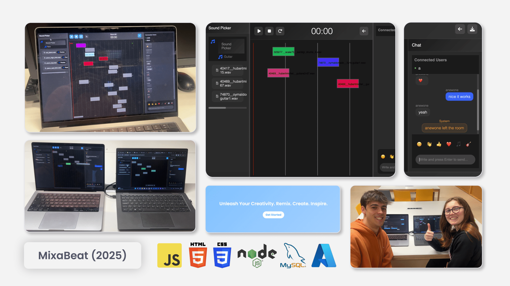

---

# Mixabeat, a conceptual realtime collaborative audio mixer and beat-maker

#### A project for the **UPF - Virtual Communication Environments** course, 2025

**Mixabeat** is a conceptual realtime collaborative audio mixer and beat-maker built using vanilla JS/HTML/CSS for the frontend and Node/Express/MySQL for the backend.



The full-stack application we developed has been moved into a monorepo structure, with the backend and frontend code in separate directories:

```plaintext
mixabeat/
├── server/       # Backend: Node.js application
│   ├── database/
│   ├── middleware/
│   ├── routes/
│   ├── services/
│   ├── sounds/
│   ├── utils/
│   └── websocket/
└── src/          # Frontend: Web application (HTML, CSS, JavaScript)
    ├── auth/
    ├── landing/
    ├── room/
    ├── search/
    └── utils/
```

## Full functionality walkthrough

https://github.com/user-attachments/assets/b72b00aa-e0f4-427c-b060-be9c9a40ab33

## Docs and development notes

An interesting thing about this repository is that, even after merging the frontend and backend into a monorepo, we have kept all [commits](https://github.com/uripont/mixabeat/commits/main/) and [Issue history intact](https://github.com/uripont/mixabeat/issues?q=is%3Aissue%20state%3Aclosed). This means the whole set of documentation and development conversations are preserved, to see the gradual evolution of the project from scratch, across several refactors and iterations, until the final version. 

Not only there are screenshots of the different iterations ([example](https://github.com/uripont/mixabeat/issues/13)), but also explanations of the design decisions and higher-level architecture diagrams ([example](https://github.com/uripont/mixabeat/issues/9)).

## Test it yourself

Part of the *fun* of this project was to stick to barebones technologies, and perform all steps of development as manually as possible. This way we could understand the underlying technologies better, and the pain points that lead to the creation of more modern frameworks, libraries and tools.

For the deployment story, this was the same: we used a simple VM on a cloud provider, installed dependencies manually (as described in `docs`), and deployed the application by SSH-ing into the VM to transfer the files. This means there is no straightforward way to test the application without going through the same steps, and we haven't wasted time to automate the deployment process. This project was meant to be a learning experience, not a production-ready application.
