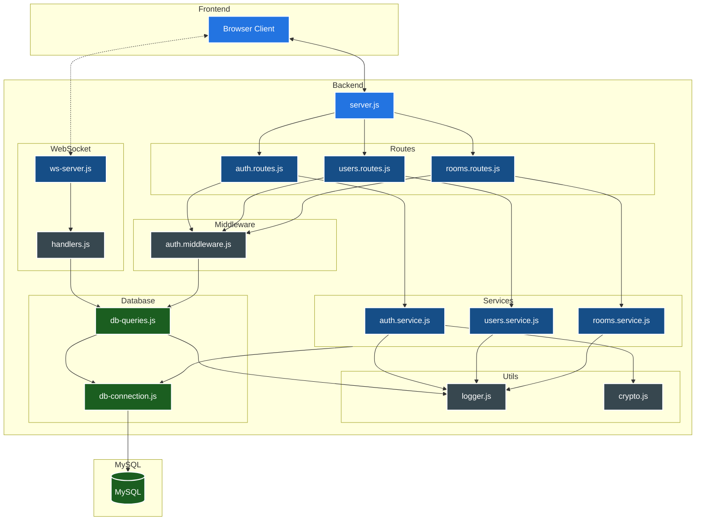

## Architecture Overview



## Server Deployment Guide

### VM Setup
1. If the VM is shut down, start it using:
    - Azure portal
    - Cloud provider dashboard
    - CLI tooling

### Prerequisites
- Apache server (pre-installed and running on VM)
- SSH access credentials
- VM public IP: http://20.26.232.219
- MySQL database configured (see Database Setup)

### Database Setup
The application uses MySQL with two users:
- **root**: Admin access (local & remote) for database configuration
- **serverUser**: Limited privileges for Node.js application (localhost only)

1. Run database setup (note: passwords are templates, replace with secure values):
```bash
mysql -u root -p < creating_database.sql
```

2. Configure application:
```bash
cp env-template.txt .env
# Update .env with proper credentials
```

For direct database access from IDE, temporarily open VM port 3306 via Azure portal.

### Connecting to VM
Connect via SSH using your development machine:

```bash
ssh -i '/Users/uripont/.../Mixabeat-Server-VM_key.pem' uripont-admin@20.26.232.219
```

### Starting the API Server
Launch the Node.js server as a background process:

```bash
node server/server.js &
```

### Testing the API
Test the root endpoint from your local machine:

```bash
curl -v http://20.26.232.219:3000/
```

Note: Currently only the root endpoint ("/") is available.

## Current backend TODOs

For messages & chat:
- [x] Fix room joining websockets (sometimes it doesn't properly connect to joined room)
- [x] Get connected users on your room, to be called when joining (async via websocket)

For room management:
- [ ] Endpoint to list all available rooms to join
- [ ] Endpoint to join room by its current name (note that name can change over time, it's not an ID)

For song management:
- [ ] Websocket message to update your current track
    - [ ] Also makes server update the db with the updated track
- [ ] Endpoint to get current song on this room (read from db, "checkpointed")

For audio files:
- [ ] Endpoint to upload a new audio file (mp3, max size, rate limited)
- [ ] Way to serve to the client only the source audios relevant to this song, based on the tracks it has and the sounds they use   
    - [ ] Endpoint / way to request a specific subset of sound files from all the available ones
    - [ ] Serving any of the custom-uploaded audios, stored on the VM filesystem, if they are present in a song

For real-time editing experience:
- [ ] Websocket message to send mouse position on the canvas over time
- [ ] Websocket messages to send track status changes (connected but not editing, editing, marked as finished)

For auth:
- [ ] Better auth validation on endpoint (no repeated usernames, valid emails, minimum password length)
- [ ] Endpoint to change username
- [ ] Endpoint to change password
- [ ] Endpoint to delete account
