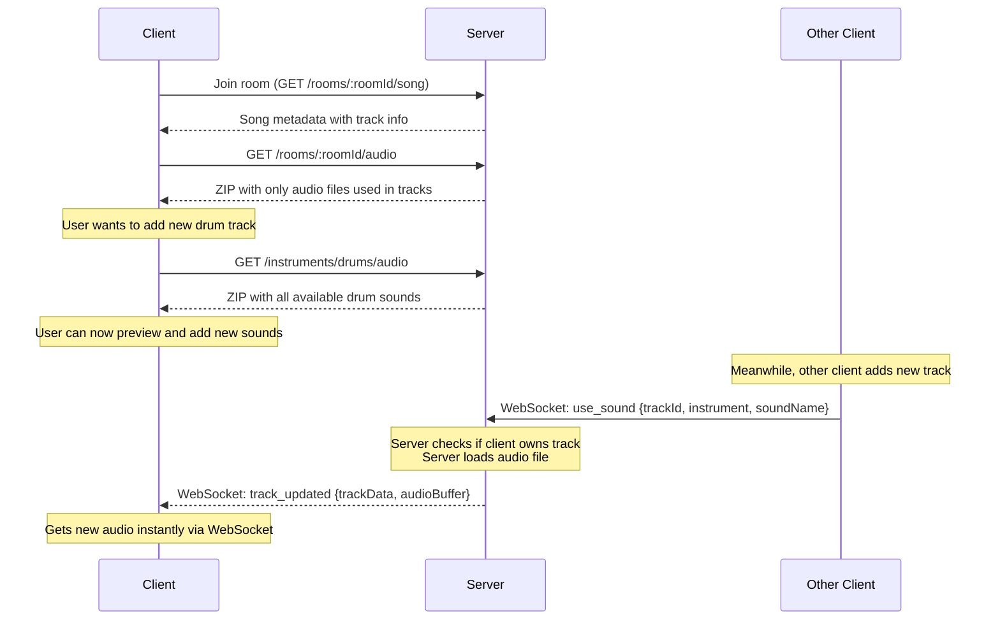

# MixaBeat Frontend

[Previous content remains unchanged until the Audio Loading Strategy section]

## Audio Loading Strategy

1. Server stores audio files organized by instrument type in `/audio` directory
2. Room contents in database references both instrument type and audio filename
3. Client makes requests in two scenarios:
   - When joining a room:
     * GET metadata (track positions, names, instruments)
     * GET ZIP of only the audio files used in current tracks
   - When adding new tracks:
     * GET all available sounds for a specific instrument
4. Connected clients receive new audio tracks in real-time:
   - When a client wants to use a sound, it sends the instrument and sound name
   - Server verifies the client owns the track
   - Server loads and includes audio data in the WebSocket message
   - Other clients receive both track metadata and audio buffer
   - No need to request audio separately when tracks are added
   - Efficient: Only the audio data that was added is transmitted

[Rest of the content remains unchanged]
