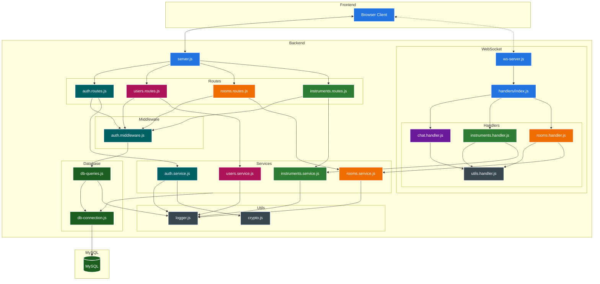

## Architecture Overview



## WebSocket Message Types

### Room Management
- **join_room**: Join a specific room
  - Parameters: `{ roomId: string }`
  - Response: `{ type: 'room_joined', roomData: object }`

### Chat
- **chat_message**: Send a chat message
  - Parameters: `{ message: string }`
  - Response: `{ type: 'chat_message', userId: string, message: string }`

### Track Management
- **use_sound**: Create or update a track with a sound
  - Parameters: `{ trackId?: string, instrument: string, soundName: string, position?: number }`
  - Response: `{ type: 'sound_updated', trackId: string, success: boolean, isNewTrack: boolean }`

- **move_track**: Update track position in real-time
  - Parameters: `{ trackId: string, position: number }`
  - Response: `{ type: 'track_moved', trackId: string, position: number }`
  - Broadcast: Sends position updates to all users in the room
  - Note: Used for real-time track movement synchronization

- **track_status**: Update track editing status
  - Parameters: `{ trackId: string, status: string }`
  - Response: `{ type: 'track_status', trackId: string, status: string }`

### Real-time Collaboration
- **mouse_position**: Share cursor position
  - Parameters: `{ x: number, y: number }`
  - Broadcast: Sends position to other users in room

## Server Deployment Guide

### VM Setup
1. If the VM is shut down, start it using:
    - Azure portal
    - Cloud provider dashboard
    - CLI tooling

### Prerequisites
- Apache server (pre-installed and running on VM)
- SSH access credentials
- VM public IP: http://20.26.232.219
- MySQL database configured (see Database Setup)

### Database Setup
The application uses MySQL with two users:
- **root**: Admin access (local & remote) for database configuration
- **serverUser**: Limited privileges for Node.js application (localhost only)

1. Run database setup (note: passwords are templates, replace with secure values):
```bash
mysql -u root -p < creating_database.sql
```

2. Configure application:
```bash
cp env-template.txt .env
# Update .env with proper credentials
```

For direct database access from IDE, temporarily open VM port 3306 via Azure portal.

### Connecting to VM
Connect via SSH using your development machine:

```bash
ssh -i '/Users/uripont/.../Mixabeat-Server-VM_key.pem' uripont-admin@20.26.232.219
```

### Starting the API Server
Launch the Node.js server as a background process:

```bash
node server/server.js &
```

### Testing the API
Test the root endpoint from your local machine:

```bash
curl -v http://20.26.232.219:3000/
```

Note: Currently only the root endpoint ("/") is available.

## Current backend TODOs

For messages & chat:
- [x] Fix room joining websockets (sometimes it doesn't properly connect to joined room)
- [x] Get connected users on your room, to be called when joining (async via websocket)

For room management:
- [x] Endpoint to list all available rooms to join
- [x] Endpoint to join room by its current name (note that name can change over time, it's not an ID)

For song management:
- [x] Websocket message to update your current track
    - [x] Also makes server update the db with the updated track
- [x] Endpoint to get current song on this room (read from db, "checkpointed")

For real-time editing experience:
- [x] Websocket message to send mouse position on the canvas over time
- [x] Websocket messages to send track status changes (connected but not editing, editing, marked as finished)
- [x] Real-time track movement synchronization between users

For auth:
- [x] Better auth validation on endpoint (no repeated usernames, valid emails, minimum password length)
- [x] Endpoint to change username
- [x] Endpoint to change password
- [x] Endpoint to delete account
